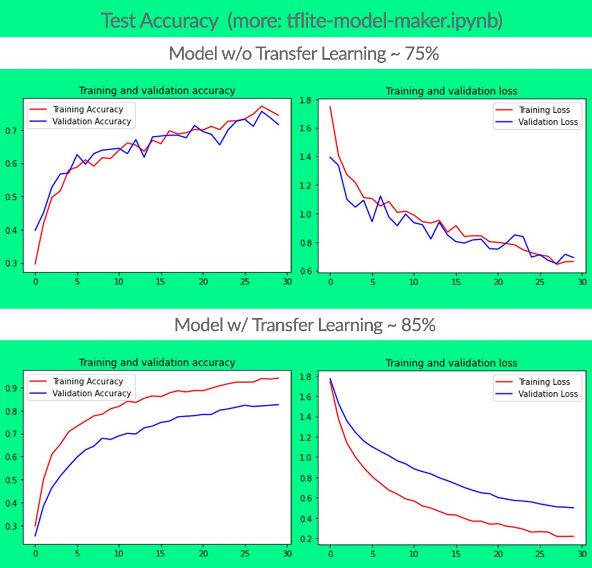
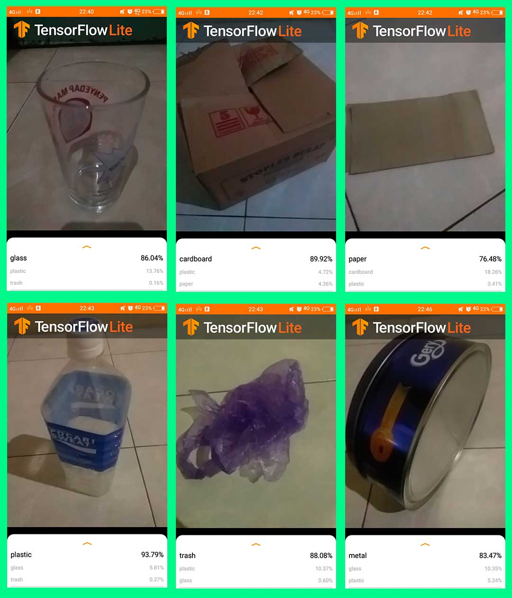

# Craftivity-Data
This project focuses on providing data for Craftivity applications. The data provided is in the form of a Trashnet dataset, ML Model for garbage classification, and craft data based on the type of Garbage.

## Model ML Garbage Classification
<table>
<tr><th colspan=2>TEST ACCURACY  with 70/15/15 ~ train/val/test</th></tr>
<tr>
  <td>w/o Transfer Learning</td>
  <td>w/ Transfer learning</td>
</tr>
<tr>
  <td>74.54%</td>
  <td>85.68%</td>
</tr>
</table>

  

Comparison of accuracy after being converted into tflite, with the model used is a model with transfer learning (MobileNetV2 with fine tuning). Considering the resulting accuracy is higher.  
<table>
<tr>
  <td>Float Model</td>
  <td>Quantization Model</td>
</tr>
<tr><th colspan=2>TEST ACCURACY TFLITE</th></tr>
<tr>
  <td>86.67%</td>
  <td>86.67%</td>
</tr>
<tr>
<th colspan=2>MODEL SIZE</th>
</tr>
<tr>
<td>8693KBs</td>
<td>2660KBs</td>
</tr>
</table>

The float model has been tested using the sample template provided by TensorFlow Lite (https://github.com/reevald/examples/tree/master/lite/codelabs/flower_classification/android/finish) with the following results:  

## Dataset
The dataset spans six classes: glass, paper, cardboard, plastic, metal, and trash. Currently, the dataset consists of 2527 images:

- 501 glass  
- 594 paper  
- 403 cardboard  
- 482 plastic  
- 410 metal  
- 137 trash  

Source : TrashNet (https://github.com/garythung/trashnet)

## Usage on Google Colab

### Step 1
Open google colab to access model-maker.ipynb via the following link: https://colab.research.google.com/drive/1V2-jmHNjT2dm-9LtqfMG9ZQ0lVmsJzAS?usp=sharing
### Step 2
Look at the menu bar, select file -> save a copy in drive, it will automatically make a copy in a new tab. Make sure that pop-up windows are not blocked. In this new tab, we will execute the cell by cell until the machine learning model is formed.
### Step 3
Run cells sequentially from top to bottom, each section equipped with related descriptions and references. Make sure the electricity and internet connection is in good condition. The resulting output is a tflite model with float and quantization types that are ready to be deployed to Android.

## Acknowledgments
- Thanks to Allah
- Thanks to Bangkit Academy 2021 instructor staff for a great class!
- Thanks to my team B21-CAP0046
- Thanks to my mentor Javentira Lienata

## TODOs
- Improve model accuracy with neural network architectures, update datasets, use other transfer learning, and more
- Testing quantization model
- Deploy the ML Model to the Cloud