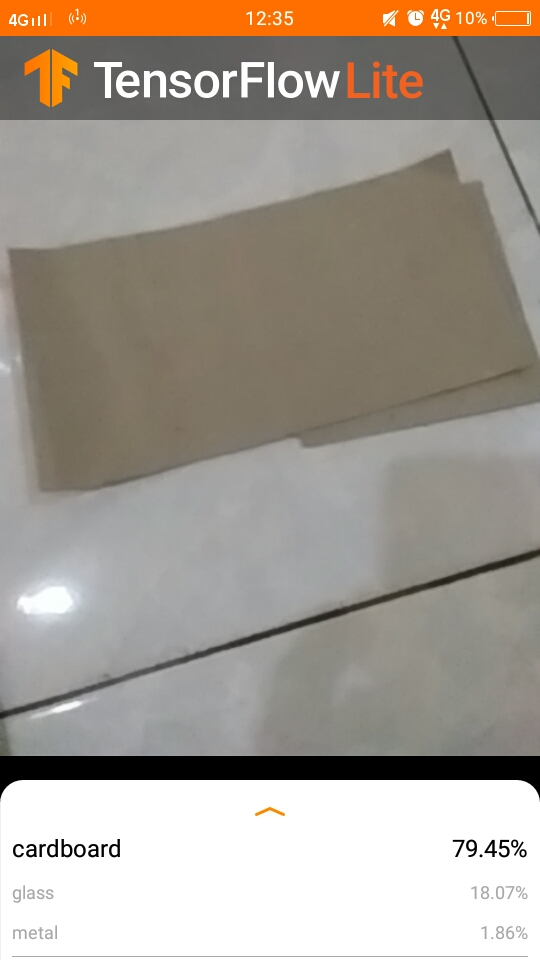
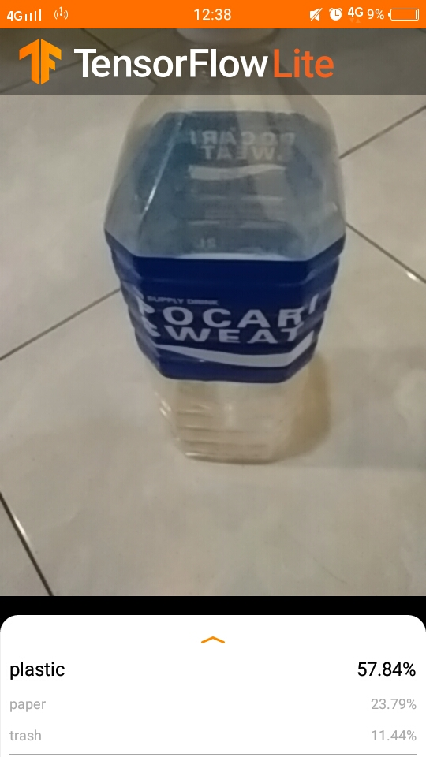
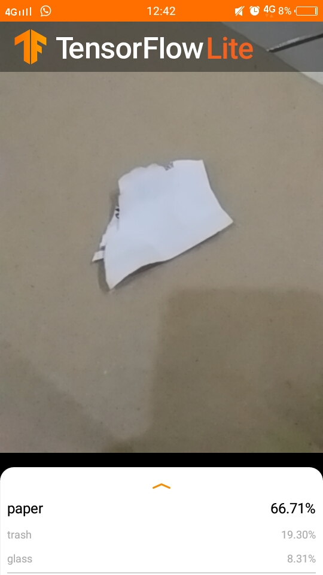
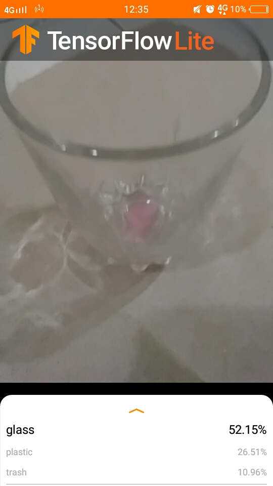
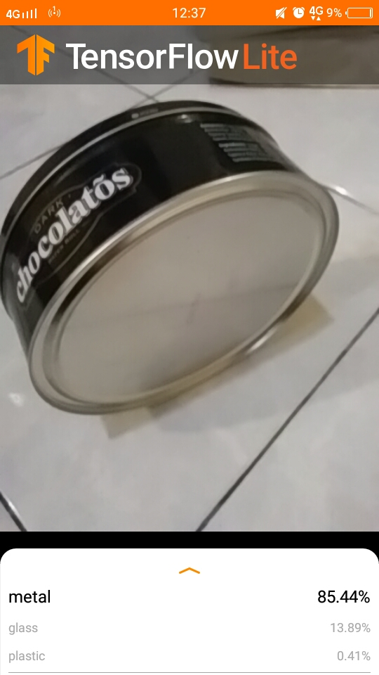

# Craftivity-Data
This project focuses on providing data for Craftivity applications. The data provided is in the form of a Trashnet dataset, ML Model for garbage detection, and craft data based on the type of Garbage.

For now, using CNN and DNN the accuracy test is ~ 80% (70/15/15 train / val / test split). The model is deployed into tflite with two types of float and quant (optimization).

The float model has been tested using the sample template provided by TensorFlow Lite (https://github.com/tensorflow/examples) with the following results:  

## Dataset
The dataset spans six classes: glass, paper, cardboard, plastic, metal, and trash. Currently, the dataset consists of 2527 images:

- 501 glass  
- 594 paper  
- 403 cardboard  
- 482 plastic  
- 410 metal  
- 137 trash  

Source : TrashNet  
Link : https://github.com/garythung/trashnet

## Usage on Google Colab

### Step 1
### Step 2
### Step 3

## Acknowledgments
- Thanks to Allah  
- Thanks to Bangkit Academy (february - june) 2021 instructor staff for a great class!
- Thanks to my team B21-CAP0046
- Thanks to my mentor Javentira Lienata

## TODOs
- Improve model accuracy with neural network architectures, update datasets, use transfer learning, and more.
- Complete the section marked with "TODO" on each file
- Deploy model ML to Android (tflite) or VM Cloud (How) ?